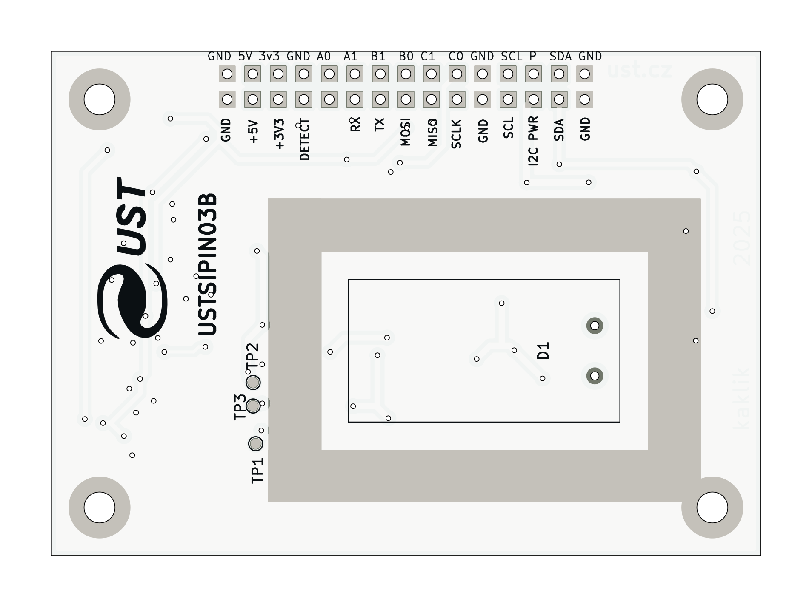
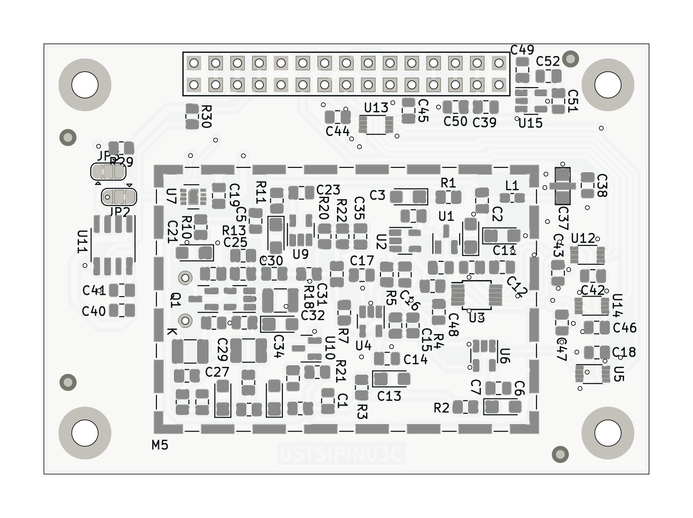

## USTSIPIN03 - Semiconductor-based ionizing radiation dosimeter and spectrometer analog front-end

The USTSIPIN03 is developed as a single-board improved variant of the [PIND02](https://github.com/mlab-modules/PIND02) and [PCRD07](https://github.com/mlab-modules/PCRD07) modules from the [MLAB.cz development system](https://www.mlab.cz/). The analog front-end is the sensing component of the [AIRDOS04 cosmic radiation detector and dosimeter](https://docs.dos.ust.cz/airdos/AIRDOS04).

### Features

* High-sensitivity silicon semiconductor PIN diode detector front-end
* Low-noise analog signal chain optimized for wide-energy radiation detection
* Designed for spectrometric and dosimetric measurements
* Suitable for connection to system MCU or FPGA via SPI interface
* Auxiliary I2C interface for service and calibration data access

### Electrical and Interface Specifications

* **Power supply**: +5 V DC
* **Maximum power consumption**: 5.5 mA (28 mW)
* **Main data interface**: SPI with up to 15 MHz system clock
* **Service interface**: I2C with access to
    * Temperature and humidity sensors
    * Unique serial number
    * Calibration memory
* Dimensions: 70.65 x 50.3 x 10 mm
* Mass: 24 g (including connector) 

### Measurement Specifications

* **Detection element**: Silicon PIN diode, volume 44 mm³
* **Effective number of energy channels**: ~65000
* **Deposited energy range**: 40 keV to 80 MeV
* **Spectral resolution**: 15 ±2 keV
* **Maximum sampling rate**: 250 kHz
* **Measurement modes**:
  * Pulse counting
  * Deposited energy spectroscopy
  * Dose rate estimation

### Applications

* Cosmic ray detection
* Environmental radiation monitoring
* Portable dosimetry systems
* Radiation protection systems
  
### Related Projects

* [AIRDOS04](https://github.com/UniversalScientificTechnologies/AIRDOS04) - Complete radiation detection system based on USTSIPIN03
* [PIND02](https://github.com/mlab-modules/PIND02) - Predecessor MLAB module
* [PCRD07](https://github.com/mlab-modules/PCRD07) - Related MLAB analog front-end module
